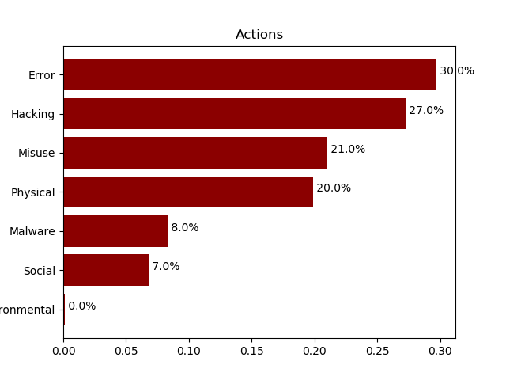

# verispy

<table>
<tr>
  <td>Latest Release</td>
  <td>
    <a href="https://pypi.org/project/verispy/">
    
    </a>
  </td>
</tr>
<tr>
  <td>License</td>
  <td>
    <a href="https://github.com/RiskLens/verispy/blob/master/LICENSE">
    
    </a>
</td>
</tr>
</table>


This is a Python package built for working with VERIS data.  This package has two main purposes:  

  1. Allow the user to extract [VERIS](http://veriscommunity.net/) JSON objects into a Pandas DataFrame structure. The most likely source of VERIS data is the VERIS Community Database ([VCDB](https://github.com/vz-risk/VCDB)).  
  2. Provide some basic data analysis functionality for the DataFrame.  This includes calculating the count and frequency of given enumerations, and plotting a simple horizontal bar chart.  

## Installation

To install this package, either `git clone` this repository, and 

```bash
python -m pip install <path>/verispy/
```

Or, you may simply use:  
```bash
pip install verispy
```

You will also need to download the VCDB data:
```bash
git clone https://github.com/vz-risk/VCDB.git
```

## Loading Data  

After installing, creating a VERIS object is simple. We just need the path to the VCDB json directory:

```python
In [1]: from verispy import VERIS

In [2]: data_dir = '../VCDB/data/json/validated/'

In [3]: v = VERIS(json_dir=data_dir)
```

We may wish to verify that the VERIS schema URL is correct. Note that the schema comes from the [VERIS](https://github.com/vz-risk/veris) repo on GitHub. If you cannot connect to the internet every time you run `verispy`, you can also download the schema and change the path locally with the `schema_path` parameter in the `json_to_df` function. 

```python
In [4]: v.schema_url
Out[4]: 'https://raw.githubusercontent.com/vz-risk/veris/master/verisc-merged.json'
```

Then, we can load the VERIS data from the JSON and assign to a DataFrame:

```python
In [5]: veris_df = v.json_to_df(verbose=True)
Loading schema
Loading JSON files to DataFrame.
Finished loading JSON files to dataframe.
Building DataFrame with enumerations.
Done building DataFrame with enumerations.
Post-Processing DataFrame (A4 Names, Victim Industries, Patterns)
Finished building VERIS DataFrame
```

## Inspecting Data

Then, we might want to inspect our DataFrame:

```python
In [6]: veris_df.shape
Out[6]: (7839, 2315)

In [7]: veris_df.head()
Out[7]: 
   action.Environmental  action.Error                  ...                    victim.state                       victim.victim_id
0                 False         False                  ...                              NJ                        C.R. Bard, Inc.
1                 False          True                  ...                             NaN   British Columbia Ministry of Finance
2                 False         False                  ...                             NaN                                    NaN
3                 False         False                  ...                              FL                 Camberwell High School
4                 False         False                  ...                             NaN  Loyalist Certification Services Exams

[5 rows x 2315 columns]

```

Do a quick value count on one of the enumerations:

```python
In [8]: veris_df['action.malware.variety.Ransomware'].value_counts()
Out[8]: 
False    7716
True      123
Name: action.malware.variety.Ransomware, dtype: int64
```

Most of the enumerations are True/False values.

To see a dictionary of the enumerations, look at the `enumerations` attribute in the VERIS object:  

```python
In [9]: len(v.enumerations)
Out[9]: 68

In [10]: import pprint

In [11]: pprint.pprint(v.enumerations)
{'action.environmental.variety': ['Deterioration',
                                  'Earthquake',
                                  'EMI',
                                  'ESD',
                                  'Fire',
                                  'Flood',
                                  'Hazmat',
                                  'Humidity',
                                  'Hurricane',
                                  'Ice',
                                  'Landslide',
                                  'Leak',
                                  'Lightning',
                                  'Meteorite',
                                  'Particulates',
                                  'Pathogen',
                                  'Power failure',
                                  'Temperature',
                                  'Tornado',
                                  'Tsunami',
                                  'Vermin',
                                  'Volcano',
                                  'Wind',
                                  'Other',
                                  'Unknown'],
 'action.error.variety': ['Capacity shortage',
                          'Classification error',
                          'Data entry error',
                          'Disposal error',
                          'Gaffe',
                          'Loss',

                          ... 
                          # many more lines
```

## Analysis

The `enum_summary` (get enumerations with confidence intervals) function is the main analysis function within `verispy`.  

We can look at top-level enumerations: 

```python
In [12]: v.enum_summary(veris_df, 'action')
Out[12]: 
            enum     x       n     freq
0          Error  2268  7629.0  0.29729
1        Hacking  2079  7629.0  0.27251
2         Misuse  1604  7629.0  0.21025
3       Physical  1517  7629.0  0.19885
4        Malware   635  7629.0  0.08324
5         Social   517  7629.0  0.06777
6  Environmental     8  7629.0  0.00105
7        Unknown   210     NaN      NaN
```

Or lower-level enumerations:

```python
In [13]: v.enum_summary(veris_df, 'action.social.variety')
Out[13]: 
           enum    x      n     freq
0      Phishing  350  501.0  0.69860
1       Bribery   51  501.0  0.10180
2    Pretexting   41  501.0  0.08184
3     Extortion   33  501.0  0.06587
4       Forgery   16  501.0  0.03194
5     Influence   13  501.0  0.02595
6         Other   10  501.0  0.01996
7       Baiting    2  501.0  0.00399
8   Elicitation    2  501.0  0.00399
9    Propaganda    2  501.0  0.00399
10         Scam    2  501.0  0.00399
11         Spam    1  501.0  0.00200
12      Unknown   16    NaN      NaN
```

We can add a second variable as the `by` parameter, and thus get enumerations subsetted by the "by":  

```python
In [14]: v.enum_summary(veris_df, 'action', by='attribute')
Out[14]: 
                           by           enum     x       n     freq
0      attribute.Availability       Physical  1153  2350.0  0.49064
1      attribute.Availability        Hacking   664  2350.0  0.28255
2      attribute.Availability          Error   446  2350.0  0.18979
3      attribute.Availability        Malware   138  2350.0  0.05872
4      attribute.Availability         Misuse    67  2350.0  0.02851
5      attribute.Availability         Social    59  2350.0  0.02511
6      attribute.Availability  Environmental     8  2350.0  0.00340
7      attribute.Availability        Unknown     5     NaN      NaN
8   attribute.Confidentiality          Error  2231  7057.0  0.31614
9   attribute.Confidentiality        Hacking  1684  7057.0  0.23863
10  attribute.Confidentiality         Misuse  1552  7057.0  0.21992
11  attribute.Confidentiality       Physical  1492  7057.0  0.21142
12  attribute.Confidentiality        Malware   555  7057.0  0.07865
13  attribute.Confidentiality         Social   459  7057.0  0.06504
14  attribute.Confidentiality  Environmental     2  7057.0  0.00028
15  attribute.Confidentiality        Unknown   198     NaN      NaN
16        attribute.Integrity        Hacking   916  1833.0  0.49973
17        attribute.Integrity        Malware   635  1833.0  0.34643
18        attribute.Integrity         Social   517  1833.0  0.28205
19        attribute.Integrity       Physical   321  1833.0  0.17512
20        attribute.Integrity         Misuse   257  1833.0  0.14021
21        attribute.Integrity          Error    35  1833.0  0.01909
22        attribute.Integrity  Environmental     0  1833.0  0.00000
23        attribute.Integrity        Unknown    15     NaN      NaN
```

We can add in a confidence interval by specifying the `ci_method` (currently supported methods: `wilson`, `normal`, or `agresti_coull`, see https://www.statsmodels.org/dev/generated/statsmodels.stats.proportion.proportion_confint.html for more information):

```python
In [15]: v.enum_summary(veris_df, 'action.social.variety', ci_method='wilson')
Out[15]: 
           enum    x      n     freq  method    lower    upper
0      Phishing  350  501.0  0.69860  wilson  0.65704  0.73715
1       Bribery   51  501.0  0.10180  wilson  0.07828  0.13138
2    Pretexting   41  501.0  0.08184  wilson  0.06090  0.10914
3     Extortion   33  501.0  0.06587  wilson  0.04728  0.09106
4       Forgery   16  501.0  0.03194  wilson  0.01975  0.05124
5     Influence   13  501.0  0.02595  wilson  0.01523  0.04388
6         Other   10  501.0  0.01996  wilson  0.01088  0.03635
7       Baiting    2  501.0  0.00399  wilson  0.00110  0.01444
8   Elicitation    2  501.0  0.00399  wilson  0.00110  0.01444
9    Propaganda    2  501.0  0.00399  wilson  0.00110  0.01444
10         Scam    2  501.0  0.00399  wilson  0.00110  0.01444
11         Spam    1  501.0  0.00200  wilson  0.00035  0.01122
12      Unknown   16    NaN      NaN  wilson      NaN      NaN
```

And we can change the confidence interval width with `ci_level` (default is 0.95):

```python
In [16]: v.enum_summary(veris_df, 'action.social.variety', ci_method='wilson', ci_level=0.5)
Out[16]: 
           enum    x      n     freq  method    lower    upper
0      Phishing  350  501.0  0.69860  wilson  0.68460  0.71224
1       Bribery   51  501.0  0.10180  wilson  0.09304  0.11127
2    Pretexting   41  501.0  0.08184  wilson  0.07395  0.09048
3     Extortion   33  501.0  0.06587  wilson  0.05878  0.07374
4       Forgery   16  501.0  0.03194  wilson  0.02705  0.03767
5     Influence   13  501.0  0.02595  wilson  0.02157  0.03119
6         Other   10  501.0  0.01996  wilson  0.01616  0.02463
7       Baiting    2  501.0  0.00399  wilson  0.00249  0.00639
8   Elicitation    2  501.0  0.00399  wilson  0.00249  0.00639
9    Propaganda    2  501.0  0.00399  wilson  0.00249  0.00639
10         Scam    2  501.0  0.00399  wilson  0.00249  0.00639
11         Spam    1  501.0  0.00200  wilson  0.00103  0.00387
12      Unknown   16    NaN      NaN  wilson      NaN      NaN
```

The `enum_summary` function returns a DataFrame. With this enumeration DataFrame, we can then draw a simple horizontal bar chart with the `plot_barchart` function:

```python
In [17]: actionci_df = v.enum_summary(veris_df, 'action')

In [18]: action_fig = v.plot_barchart(actionci_df, 'Actions')

In [19]: action_fig.show()
```



## Clustering with Patterns

Another useful feature of the `verispy` package is the `df_to_matrix` function, which converts the VERIS DataFrame into a matrix of boolean values for selected enumerations. This feature is inspired by the blog post [DBIR Data-Driven Cover](http://datadrivensecurity.info/blog/posts/2014/May/dbir-mds/) by Jay Jacobs. This blog post talks about the DBIR "Patterns," which were originally described in the [2014 DBIR](https://www.verizonenterprise.com/resources/reports/rp_Verizon-DBIR-2014_en_xg.pdf). 

### Patterns Function

In Jay's blog post, he points the reader to a GitHub gist with a function he wrote, getpatternlist.R. We have taken that R function and converted it to Python; it may be found at this gist: [dbir_patterns.py](https://gist.github.com/tbyers-risklens/cd7e61be6c6c420f859e43066658940a).

Using this function, we can create a data frame with the DBIR patterns:

```python
In [23]: import pandas as pd

def get_pattern(df):
    """ Generates the DBIR "patterns," with liberal inspiration from the getpatternlist.R: 
    https://gist.github.com/jayjacobs/a145cb87551f551fc719

    Parameters
    ----------
    df: pd DataFrame with most VERIS encodings already built (from verispy package).

    Returns
    -------
    pd DataFrame with the patterns. Does not return as part of original VERIS DF.
    """
    skimmer = df['action.physical.variety.Skimmer'] | \
              (df['action.physical.variety.Tampering'] & df['attribute.confidentiality.data.variety.Payment'])
    
    espionage = df['actor.external.motive.Espionage'] | df['actor.external.variety.State-affiliated']
.... (more lines, see gist)

In [23]: patterns = get_pattern(veris_df)

In [24]: patterns['pattern'].value_counts()
Out[24]: 
Miscellaneous Errors      1814
Privilege Misuse          1597
Lost and Stolen Assets    1460
Everything Else           1028
Web Applications           896
Payment Card Skimmers      278
Crimeware                  268
Cyber-Espionage            248
Denial of Service          162
Point of Sale               88
Name: pattern, dtype: int64
```

From here, we can go back to our `veris_df` DataFrame and make a boolean VERIS matrix:

```python
In [25]: vmat = v.df_to_matrix(veris_df)

In [26]: vmat
Out[26]: 
array([[0, 0, 0, ..., 0, 0, 0],
       [0, 0, 0, ..., 0, 0, 0],
       [0, 1, 1, ..., 0, 1, 0],
       ...,
       [0, 0, 1, ..., 0, 0, 0],
       [0, 0, 0, ..., 0, 0, 0],
       [0, 0, 1, ..., 0, 0, 0]])

In [27]: vmat.shape
Out[27]: (7839, 569)
```

Then, we can do a dimensionality-reducing technique called [TSNE](https://lvdmaaten.github.io/tsne/). The following operation may take several minutes:

```python
In [28]: from sklearn.manifold import TSNE

In [29]: tsne = TSNE(n_components=2, random_state=42)

In [30]: v_tsne = tsne.fit_transform(vmat)
``` 

Finally, we can create the following plot, which we have colored by DBIR "Pattern", using Seaborn:

```python
In [31]: import seaborn as sns

In [32]: import pandas as pd

In [33]: import matplotlib.pyplot as plt

In [34]: tsne_df = pd.DataFrame({'x':v_tsne[:, 0], 'y':v_tsne[:, 1], 'pattern':patterns['pattern']})

In [35]: tsne_df.head()
Out[35]: 
           x          y               pattern
0   0.411892 -34.907738      Privilege Misuse
1  29.374905  12.816430  Miscellaneous Errors
2 -63.858070 -47.406250       Cyber-Espionage
3 -58.987106   7.611073      Web Applications
4 -75.674927   7.452817      Web Applications

In [36]: tsne_centers = tsne_df.groupby(by='pattern').mean()
    ...: tsne_centers['pattern'] = tsne_centers.index

In [37]: p1 = sns.lmplot(x='x', y='y', data=tsne_df, fit_reg=False, hue='pattern',
    ...:                 scatter_kws={'alpha':0.25}, size=6)
    ...:                 

In [38]: def label_point(df, ax):
    ...:     for i, point in df.iterrows():
    ...:         ax.text(point['x'] - 30, point['y'], point['pattern'])
    ...:         

In [39]: label_point(tsne_centers, plt.gca())

In [40]: plt.show()
```


## Unit Testing

Unit tested with `pytest`

```bash
(veris) verispy $ pytest
======================================================= test session starts ========================================================
platform darwin -- Python 3.6.5, pytest-3.5.1, py-1.5.3, pluggy-0.6.0
rootdir: /Users/tylerbyers/src/verispy, inifile:
plugins: remotedata-0.2.1, openfiles-0.3.0, doctestplus-0.1.3, arraydiff-0.2
collected 8 items                                                                                                                  

verispy/tests/test_veris.py ........                                                                                         [100%]

==================================================== 8 passed in 11.50 seconds =====================================================
```


